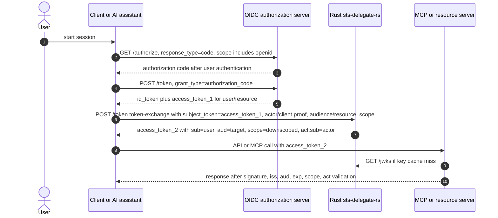

# Okta, OBO, and MCP Docs Plan

This plan adapts the Python and `obo-lab` OBO material for Rust users without copying
deployment-specific claims into the Rust product. It addresses issue #58.

## Three Behaviors To Keep Separate

| Behavior | What it means | Rust status |
| --- | --- | --- |
| OIDC login | A client uses an authorization server `/authorize` and `/token` flow to obtain an ID token and usually an access token for the user. | Not shipped by Rust. The Rust STS consumes tokens; it does not log the user in. |
| Okta-documented OBO | A service app exchanges a user access token at Okta's `/token` endpoint using the token-exchange grant and gets a downstream access token. | External behavior. Rust docs may explain the pattern, but Rust is not Okta. |
| Rust token exchange | A caller posts to the Rust `/token` endpoint with a subject token plus actor/client proof and receives a scoped token. | Shipped. This is the Rust product surface. |

## Claim Mapping

| Concept | Okta public OBO docs commonly show | Rust STS output |
| --- | --- | --- |
| User identity | `sub` remains the original user | `sub` remains the original user |
| Downstream target | `aud` changes to the downstream authorization server/resource audience | `aud` is the single resolved `audience`/`resource` target |
| Downstream scopes | `scp` contains granted scopes | `scope` contains the downscoped scope string |
| Exchanging service | `cid` identifies the service app/client that performed the exchange | `client_id` identifies the caller/client; delegation also carries `act.sub` |
| Explicit actor | Okta examples reviewed in the Python docs did not show RFC 8693 `act` | Rust delegation emits `act={sub: actor}` |
| Authorized actor | Okta examples reviewed did not show `may_act` | Rust reads subject-token `may_act` when present to authorize delegation |
| Sender constraint | Provider-specific unless DPoP is configured | Rust supports DPoP proof validation at `/token` and emits `cnf.jkt` |

## Endpoint-Level Flow

```text
OIDC login, outside Rust:

User/browser/client
  -> Authorization Server /authorize
     response_type=code
     scope=openid profile email ...
     audience/resource=the first protected resource, if provider supports it

Client
  -> Authorization Server /token
     grant_type=authorization_code
     code=...
     code_verifier=...

Authorization Server
  -> Client
     id_token       = authentication result for the client
     access_token_1 = OAuth token for the requested resource/UserInfo/API

Rust token exchange:

Client/MCP/gateway
  -> Rust STS /token
     grant_type=urn:ietf:params:oauth:grant-type:token-exchange
     subject_token=access_token_1
     subject_token_type=urn:ietf:params:oauth:token-type:access_token
     actor_token=<actor assertion, delegation path>
     actor_token_type=urn:ietf:params:oauth:token-type:jwt
     audience or resource=api://databricks-mcp
     scope=databricks.read
     optional DPoP header

Rust STS
  -> Client/MCP/gateway
     access_token_2 = scoped at+jwt
     claims: iss, sub=user, aud=api://databricks-mcp, scope=databricks.read,
             act={sub: actor}, client_id, exp, iat, jti, optional cnf.jkt

MCP/resource server
  -> Rust STS /jwks
     fetch public signing key

MCP/resource server
  -> local verifier
     require iss, aud, exp, signature, and if applicable act/cnf.jkt
```

## Mermaid Source For The Rust Docs

This source avoids `<br>` tags because GitHub Mermaid sequence labels parse those poorly.



## UserInfo

OIDC UserInfo is an OAuth-protected endpoint at the OIDC provider. It returns claims
about the authenticated end-user when called with an access token that is valid for
UserInfo. It can help a client fetch profile claims, but it does not replace token
exchange, resource-server audience checks, actor attribution, replay checks, or DPoP.

Rust docs should mention UserInfo only when explaining OIDC login context. The Rust STS
does not call UserInfo in its current token-exchange runtime.

## Documentation Rules For This Topic

- Use `access_token_1` for the user's first OAuth access token and `access_token_2`
  for the Rust-minted scoped token.
- Use `id_token` only for OIDC authentication results. Do not send an ID token as the
  Rust `subject_token` unless a future issue explicitly supports and tests that profile.
- Treat Okta `cid` as service-client evidence, not as an RFC 8693 `act` claim.
- Keep all examples redacted. Show decoded claims, fingerprints, lengths, and key IDs,
  not raw bearer tokens.
- State that `/authorize` belongs to the upstream authorization server, not Rust.
